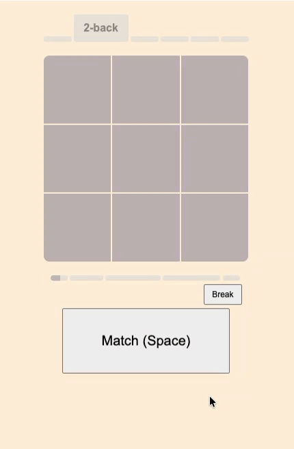

# [BrainZag.com](https://www.brainzag.com/)

BrainZag is a "Color [N-back](https://en.wikipedia.org/wiki/N-back)" brain training app to improve your **working memory**. It's color only - the position is random and irrelevant. Focus on remembering the last N sequence of colors and hold them in your mind.

 

  

### How to play
- Basic gameplay: You are shown a sequence of colors one at a time. Your goal is to identify **if the <u>current color</u> matches the one from N steps earlier** in the sequence. For example in a 2-back game, if the sequence is: *red, blue, <u>red</u>* - you would recognize the *<u>current red</u>* as a match to the *red two steps before* -> click Match.

- In your mind try to update the information "***going forward + looking backwards***", given an example sequence: *yellow, blue, <u>red</u>* - update your mind with: [*yellow*], [*blue -> yellow*] and [*<u>red</u> -> blue -> yellow*].

- While playing, **avoid trying to actively repeat** the tiles very quickly in order to refresh them. Rather put them into different mind buckets, and let your brain manage them. It will automatically refresh/repeat them, but not you actively + consciously doing it. If you catch yourself speedy repeating them - stop it.
Rather it should feel like your brain is pinging the buckets on its own, and you merely observe it happening. Overall, it should feel like that your bucket's information is quickly fading away - this "*not fading*" is what we train.

- Avoid any strategies and chunking.

### Features
- Adaptive difficulty - based on your recent performance. BrainZag models your current **working memory capacity** and slowly expands it by introducing more distinct colors per sliding window. This allows for a smoother experience and avoids random difficulty spikes
- Infinite mode - why stop after 20 trials
- Responsive UI - doesnt look and feel like any other N-back app
- Daily time progress bar - it is recommended that you **train 20 minutes per day**
- Works fully offline - load the page once and it will keep working even without internet

 

## Working memory

The ability to store and manipulate information for short periods of time.

- [Improving fluid intelligence with training on working memory](https://scholar.google.com/citations?view_op=view_citation&hl=en&user=xEbuGsAAAAAJ&citation_for_view=xEbuGsAAAAAJ:u5HHmVD_uO8C)
- [A meta-analysis](https://scholar.google.com/citations?view_op=view_citation&hl=en&user=xEbuGsAAAAAJ&citation_for_view=xEbuGsAAAAAJ:NMxIlDl6LWMC) - ([youtube video presentation](https://www.youtube.com/watch?v=YfD-UzyKhAo&t=505s))

An improved working memory will help you to **learn faster, remember more, solve novel problems** and **stay focused longer**.
Together this can improve your performance on exams/tests:
- Suneung 🇰🇷
- Todai 🇯🇵
- Gaokao 🇨🇳
- Raven’s - Wechsler Scales (WAIS) - Stanford-Binet
- CBSE - NEET - JEE Advanced - UPSC CSE 🇮🇳
- BMAT - MCAT - USMLE - LSAT 🇬🇧 / 🇺🇸
- Leetcode - Job interviews

## Color N-back
Most [N-back](https://en.wikipedia.org/wiki/N-back) apps/websites are "dual-n-back" and focus on position + audio stimuli. BrainZag however is purely color. Playing any N-back game requires you to **hold and update** information in your mind. Your brain is very efficient and smart and will always find a way to make your task easier:

- **position-n-back**: with increasing N level your brain will automatically try to cache the information and instead of actively recalling the last N positions you will tend to remember swipe motions like unlocking your phone.
- **audio-n-back**: your brain will attempt to chunk or try to lean on common abbreviations. Also how do you play this on the go in the bus/train ?
- **shape-n-back**: now it gets harder to cache and condense the information-stimuli, your brain will result to chunking a little story e.g. turtle -> house -> sun, turns into "a turtle came into the house on a sunny day"

We dont want to make it easier for the brain! We want to prevent automatic chunking and strategies to condense information.

**Color N-back** gives us that, how do you chunk a bunch of colors? Apart from a traffic light, your two favourite colors and a few country flags its very hard to use a strategy to condense/cache >3 colors in your mind.

Evolutionary, position and audio input is optimized for **survival**: movement, communication, orientation. While color is more **abstract** for the brain, we might react strongly to immediate colors (*red blood, blue sky*) but holding a sequence of different color combinations is very hard for the brain.

## Contact
- [Send me an email](mailto:rqp314+brainzag@gmail.com?subject=BrainZag)

## License

You may use, study, modify, and share this software for non-commercial purposes only.
Any commercial use requires a separate license from the copyright holder.

See the `LICENSE` file for full terms.
